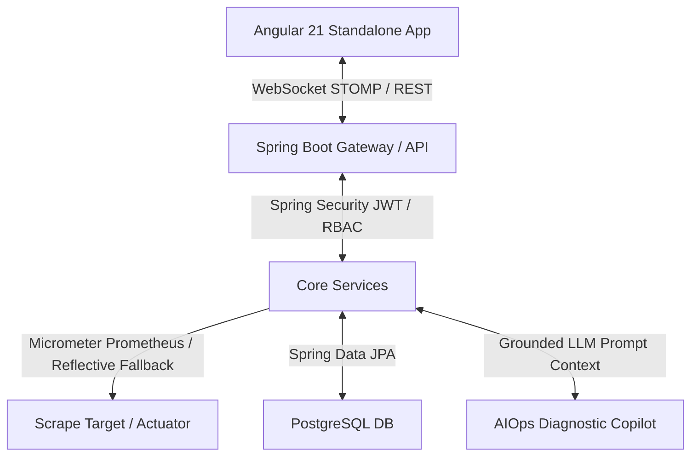

# 🌌 NexusOps — AI-Powered Incident Command Center & Observability Platform

NexusOps is a production-grade, enterprise-ready cloud observability and real-time incident response platform. Built using **Spring Boot (Java 21)** and **Angular 21**, it monitors distributed application metrics, detects infrastructure anomalies, and provides contextualized, telemetry-grounded AI diagnostic assistance.

---

## 🚀 Architectural Overview

NexusOps is designed around a **clean, layered MVC architecture** with strict separation of concerns, transactional integrity, and fault-tolerant system boundaries.



### Core Architectural Features:
*   **Layered Security (JWT & RBAC):** End-to-end token validation with state-isolated multi-tenant structures (`organizations`, `users`, `projects`, `services`).
*   **High-Fidelity Telemetry Scraper:** Periodically polls target services every 5 seconds. Connects directly to Prometheus, with an advanced fallback scraping JVM MXBean metrics and parsing raw Micrometer actuator outputs in the event of telemetry platform downtime.
*   **Event-Driven Rule Engine:** Evaluates scrape metrics against strict SLA thresholds. Instantly spawns incidents, logs immutable audit logs, triggers email/channel notifications, and broadcasts status changes over WebSocket brokers.
*   **Grounded AIOps Co-pilot:** Integrates an AI command assistant that retrieves live metrics context to diagnose root-causes, strictly separating facts (`[FACT]`) from diagnostic hypotheses (`[SUGGESTION]`).

---

## 🛠️ Technology Stack

| Component | Technology | Description |
|---|---|---|
| **Backend Framework** | Spring Boot 4.0.6 | Bleeding-edge microservices & API foundation |
| **Language** | Java 21 | Utilizes modern OOP & modern compiler features |
| **Security** | Spring Security, JJWT (v0.12.5) | Stateless JWT with Role-Based Access Control |
| **Frontend Framework** | Angular 21 (v21.2.0) | Standalone reactive component architecture |
| **UI Styling** | Tailwind CSS 4.0 | Premium modern design system |
| **Data Charts** | ApexCharts | High-fidelity interactive dashboards |
| **Database** | PostgreSQL | Enterprise relational storage & time-series indices |
| **Real-time Comms** | WebSockets (STOMP / SockJS) | Sub-100ms bi-directional state broadcast |
| **Telemetry System** | Prometheus, Micrometer Actuator | Production-level server instrumentation |
| **Containerization** | Docker, Docker Compose | Consistent multi-container orchestration |

---

## ⚡ Key Features

### 1. Unified Real-Time Dashboard
*   Interactive multi-series charts graphing live CPU, Memory, Request Rate (RPS), and HTTP Error Rates.
*   Automated WebSocket-driven UI synchronization—refreshes status counters instantly when state transitions occur.
*   Clean loading and error state boundaries with responsive design.

### 2. Automated Incident Lifecycle
*   Anomalies automatically trigger incidents based on strict rules (e.g., CPU > 80%, RAM > 90%, Error Rate > 1.0%).
*   Incident statuses track standard operational states (`ACTIVE`, `INVESTIGATING`, `RESOLVED`, `CLOSED`).
*   Manual operator override allows forced resolution with automated STOMP-based client broadcasts and system-wide audit logging.

### 3. Fault-Tolerant Observability
*   The metric polling engine features a robust **resilient fallback**.
*   If Prometheus goes offline, the collector catches the error and executes reflective calls on `OperatingSystemMXBean` and scrapes direct local Actuator string metrics, maintaining incident detection and telemetry-grounded AI capabilities with zero downtime.

### 4. Telemetry-Grounded AI Command Assistant
*   Natural Language Processing interface allowing operators to ask questions such as *"Why did CPU spike?"*, *"Analyze system memory"*, or *"What is the overall system health?"*.
*   Grounded RAG design: Extracts live state variables from Actuator/Prometheus, preventing LLM hallucinations and delivering structured, metric-accurate summaries.

---

## 🗄️ Database Schema Design

NexusOps features a normalized PostgreSQL schema designed for high-performance indexing and multi-tenant data isolation:

*   **Multi-Tenancy:** `organizations`, `projects`, and `services` map hierarchical ownership.
*   **Time-Series Metric snapshots:** `service_metrics` stores fast telemetry historical trends.
*   **Observability:** `service_health` logs historical ping latency and status checks.
*   **Incident Logs:** `incidents`, `incident_status_history`, and `incident_events` maintain a secure, immutable audit trail.
*   **Enterprise Integration:** `audit_logs`, `api_keys`, and `notification_channels` support secure communication integrations.

---

## 🚦 Getting Started & Run Guides

There are two ways for a third party to run **NexusOps** locally on their laptop:
*   **Method A: The Docker Compose Orchestration (Recommended — Zero System Dependencies)**
*   **Method B: The Manual Local Execution (For Development & Testing)**

---

### 🐳 Method A: One-Command Docker Compose (Recommended)

This is the fastest, cleanest way for a third party to boot the entire platform. It launches all 5 necessary services (Postgres DB, API Backend, Load spiker, Nginx Web Server, Prometheus server) pre-packaged and wired together.

#### **Prerequisites:**
*   Only **Docker** & **Docker Compose** installed on your system.

#### **Execution:**
1.  Clone the repository and open a terminal in the root folder.
2.  Launch the environment:
    ```bash
    docker compose up --build
    ```
3.  **Explore the Applications:**
    *   **Interactive Web UI:** `http://localhost:4200`
    *   **Spring Boot REST API:** `http://localhost:8080/actuator/health`
    *   **Prometheus Metrics Target:** `http://localhost:9090/targets`
    *   **Postgres Relational DB:** Port `5432` mapped securely with volume persistence.

---

### 💻 Method B: Manual Local Development Setup

If a developer wants to run microservices outside containers, follow these steps:

#### **Prerequisites:**
*   **Java 21 JDK** installed.
*   **Node.js (v18+) & npm** installed.
*   **PostgreSQL** active locally.

#### **Step 1: Database Initialization**
1.  Create a local PostgreSQL database named `cloudpulse_db`:
    ```sql
    CREATE DATABASE cloudpulse_db;
    ```
2.  Ensure database credentials in `backend/src/main/resources/application.properties` align with your local settings.

#### **Step 2: Run backend API Server**
```bash
cd backend
./mvnw spring-boot:run
```
*   The Spring Boot API starts on port `8080`.

#### **Step 3: Run load spiker demo service**
```bash
cd demo-service
./mvnw spring-boot:run
```
*   The demo loader starts on port `8081`.

#### **Step 4: Launch Angular Web Client**
```bash
cd frontend
npm install
npm run start
```
*   Open your browser and navigate to `http://localhost:4200`.

---

## 🧪 Testing and Quality Assurance

NexusOps maintains a high-quality codebase with **Test-Driven Development (TDD)** principles. The backend contains a robust suite of unit and integration tests using **JUnit 5** and **Mockito** with 100% build verification.

### Running Backend Tests
Execute the test suite using Maven:
```bash
cd backend
./mvnw test
```
**Test Scope:**
*   `PrometheusServiceTest`: Validates telemetry polling and Actuator fallback resilience.
*   `IncidentDetectionServiceTest`: Verifies automated threshold breaches, database saves, and WebSocket refresh triggers.
*   `DashboardControllerTest` & `DashboardServiceTest`: Checks API response payload consistency.
*   `AiAnalysisServiceTest` & `AiChatControllerTest`: Assures LLM grounding and query safety.
